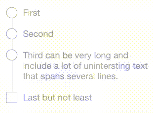
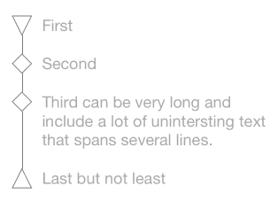

# StepProgressView
Step-by-step progress view with labels and shapes. A good replacement for UIActivityIndicatorView and UIProgressView.

[![Swift Version][swift-image]][swift-url]
[![Build Status][travis-image]][travis-url]
[![License][license-image]][license-url]
[](https://img.shields.io/cocoapods/v/StepProgressView.svg)  
[](http://cocoapods.org/pods/StepProgressView)
[](http://makeapullrequest.com)

<p align="center">


</p>

## Usage

```swift
let progressView   = StepProgressView(frame: view.bounds)
progressView.steps = ["First", "Second", "Third", "Last"]
progressView.details = [0: "The beginning", 3: "The end"] // appears below step title

progressView.currentStep = 0 // started first step
...
progressView.currentStep = 4 // all done
```

## Changing Appearance

The properties below can be set in Interface Builder, in code, or through a UIAppearance proxy (e.g., `StepProgressView.appearance().stepShape = .circle`).

**Shape of the step icons:**

```swift
progressView.stepShape = .circle
progressView.firstStepShape = .rhombus
progressView.lastStepShape = .square
// also available: .triangle, .downTriangle
```

**Text fonts and sizes:**

```swift
progressView.textFont = myFont
progressView.detailFont = anotherFont
```

**Line size spacing:**

```swift
progressView.lineWidth = 2.5
progressView.verticalPadding = 8 // between steps (0 => default based on textFont)
progressView.horizontalPadding: 8 // between shape and text (0 => default based on textFont)
```

**Colors:**


```swift
progressView.tintColor = myGeneralTintColor

// alternatively:

progressView.currentStepColor = .red
progressView.pastStepColor = .gray
progressView.futureStepColor = .gray

progressView.currentStepFillColor = .yellow
progressView.pastStepFillColor = .gray
progressView.futureStepFillColor = .lightGray

progressView.currentTextColor = .blue
progressView.pastTextColor = .gray
progressView.futureTextColor = .lightGray
progressView.currentDetailColor = .cyan // nil => use currentStepColor
```

## Installation

### CocoaPods:

```ruby
pod 'StepProgressView'
```

Legacy versions:

| Swift version | StepProgressView version |
| :---: | :--- |
| 4.0 (Xcode 9.4) | `pod 'MiniLayout', '~> 1.2.1'`<br>`pod 'StepProgressView', '~> 1.4.1'` |
| 3 | `pod 'MiniLayout', '~> 1.1.0'`<br>`pod 'StepProgressView', '~> 1.3.0'` |
| 2.3 | `pod 'MiniLayout', '~> 1.0.1'`<br>`pod 'StepProgressView', '~> 1.2.1'` |

## Meta

[@yonatsharon](https://twitter.com/yonatsharon)

[https://github.com/yonat/StepProgressView](https://github.com/yonat/StepProgressView)

[swift-image]:https://img.shields.io/badge/swift-5.0-orange.svg
[swift-url]: https://swift.org/
[license-image]: https://img.shields.io/badge/License-MIT-blue.svg
[license-url]: LICENSE.txt
[travis-image]: https://img.shields.io/travis/dbader/node-datadog-metrics/master.svg?style=flat-square
[travis-url]: https://travis-ci.org/dbader/node-datadog-metrics
[codebeat-image]: https://codebeat.co/badges/c19b47ea-2f9d-45df-8458-b2d952fe9dad
[codebeat-url]: https://codebeat.co/projects/github-com-vsouza-awesomeios-com
